--- 
 classoption:
 - twocolumn 
 author: Andrea Vitaletti 
---
# Buon anno dalla Sicilia
*02-01-2007*

 
  

   Ciao a tutti...
  

  

   Con Mep siamo in Sicilia da zio Nicola e zia Annagloria. Siamo partiti da Napoli il 30, cosa estemporanea come al nostro solito e siamo sbarcati nella magnifica Palermo. Da li brum...brum... verso Catania. Che bella! Siamo arrivati al Carrubo di mattina presto, ma zio Nicola era stato chiamato in missione e dunque non c'erano. Abbiamo chiamato la zia al telefone e "...siamo di fronte al tuo cancello"..."... non ci posso credere sono scioccata!". Poi abbiamo aspettato che lo zio tornasse... :-D non ha trovato Annagloria a casa e .... scena di gelosia, ma poi quando ha visto che c'ero io, m'ha subito coccolata. Abbiamo organizzato una buona cenetta e poi ballato a più non posso fino al nuovo anno. Alla fine ero stanca e mi sono accucciolata... BUON ANNO, IL MIO PRIMO ANNO!
  

  

   P.S. Oggi si lavora...
  

  

   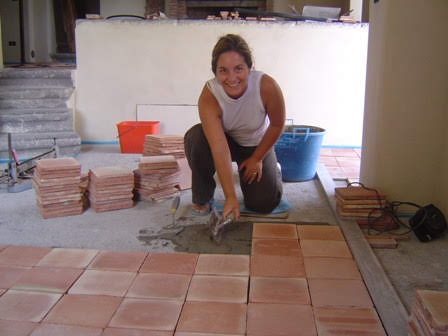
  

 

# Cybernonni
*11-01-2007*

 
  

   Da oggi nonna Lilli e nonno Gianni sono online con la loro nuova adsl... tremate :-)
  

 

# Ecco Lucia
*11-01-2007*

 
  

   Finalmente oggi ho conosciuto Lucia. Che carina, mi sa che faremo grandi cose insieme... intanto stasera ci mangiamo la prima pizza... vabbè col latte di mamma!!!
  

  

   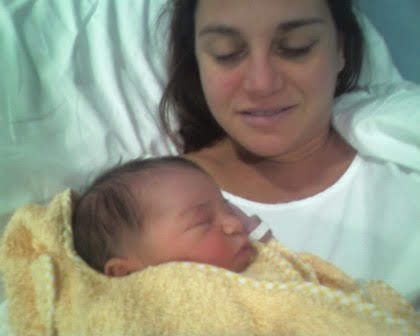
  

  

   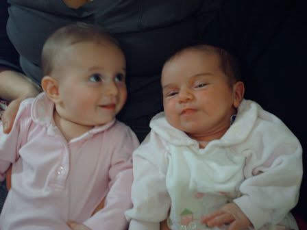
  

 

# Un babbo natale un po' speciale! 
*12-01-2007*

 
  

   Ciao, ecco la mia gemellina Toporosa in versione Babbo Natale!Carina vero?
  

  

   
  

 

# Un topino rosa battezzato
*14-01-2007*

 
  

   Ciao Gemellina
   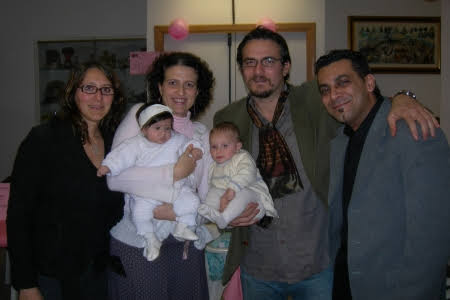
  

  

   E guardate un pò come era bella!!
  

  

   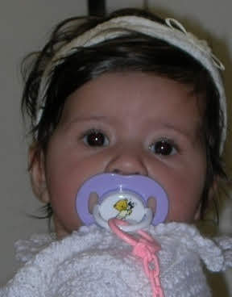
  

 

# La Befana viene... dall'alto
*15-01-2007*

 
  

   Bruno, Andrea e Luca "
   <em>
    hanno volteggiato, con i loro paramotore gettando caramelle e dolcetti sulla folla estasiata e con il naso all'insù
   </em>
   "... cita l'articolo apparso sul giornale Nuovo Oggi Castelli di Giovedi 11 Gennaio 2007. 
  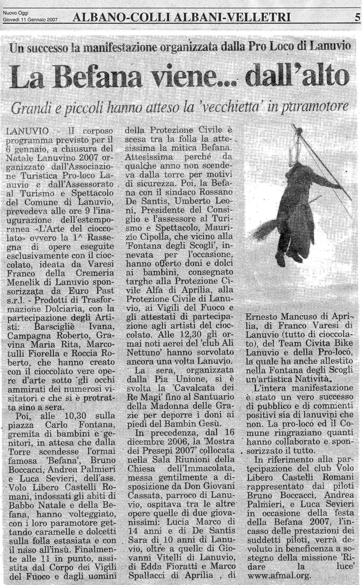
  

   Per di più i soldi raccolti sono stati devoluti in beneficenza... Grandi ragazzi. Evvai così.
  

 

# 1 Gennaio 2007
*20-01-2007*

 
  

   ciao,
vi racconto la mia prima giornata del 2007 :)
  

  

   Dopo aver ballato fino a tardi col mio papà  la notte di capodanno ed essermi fatta coccolare dalla mia mamma appena sveglia, siamo stati, insieme ad annagloria e nic, a fare una passeggiata a 1700 m sull'Etna!Che bello, passare dal mare alla montagna in così poco tempo...e poi c'era tantissima neve e un panorama bellissimo, faceva caldo e lo zio nic mi ha tirata con lo slittino!Mi sono divertita tantissimo a fare delle discese spericolate e ho anche fatto qualche passetto sulla neve!
  

  

   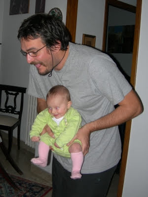
  

  

   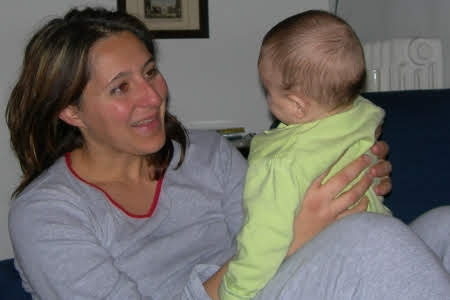
  

  

   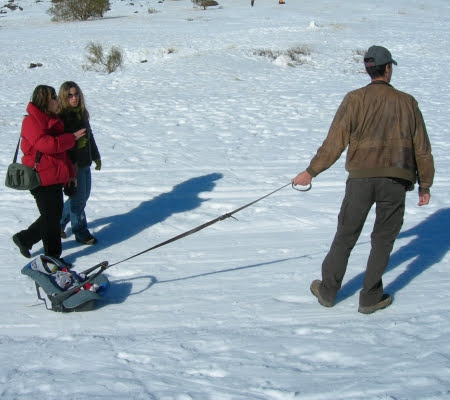
  

  

   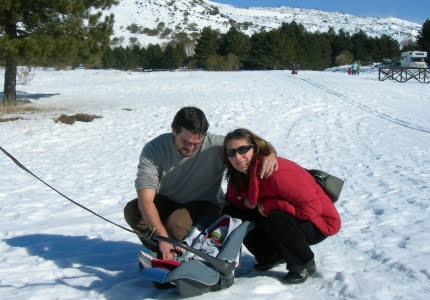
  

 

# Sono piccola e indifesa
*25-01-2007*

 
  

   ciao amici,
  

  

   guardate un pò come devo subire la mia amichetta popì....solo perchè lei è più grande di me!
  

  

   ma quando diventerò grande faremo i conti : )
  

  

   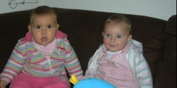
  

  

   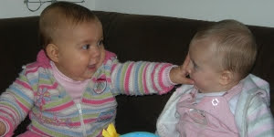
  

  

   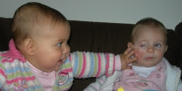
  

 

# Nonnini mi mancate
*30-01-2007*

 
  

   ciao nonnini,
  

  

   so che siete in messico a divertirvi ma mi mancate.
  

  

   vi mando un grande bacio
  

  

   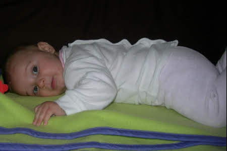
  

 

# Ancora sole e io ne approfitto
*01-02-2007*

 
  

   Eccomi qui ancora a passeggiare in una bellissima giornata di sole con la mia amichetta Popì a villa Pamphili.
  

  

   Poi insieme a zia Giorgia e Chicca sono stata a vedere la mostra del teatro delle ombre dedicata a Lele Luzzati, che divertenti quei giochi di luci e marionette!
  

  

   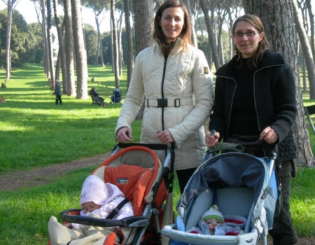
  

  

   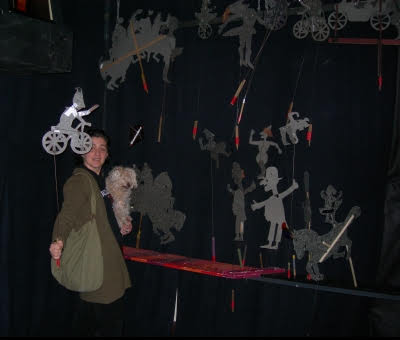
  

 

# I miei primi 20Km in bicicletta
*06-02-2007*

 
  

   ciao amici,
  

  

   questo bellissimo weekend di febbraio, ma con temperature primaverili, mi ha permesso di testare il mio fantastico carrello!
  

  

   Dietro il mio papà sfrecciavo come una campionessa delle due ruote sul lungomare di Sabaudia.Mamma ci seguiva a ruota senza perdermi di vista un minuto però!
  

  

   Tutti i ciclisti che incrociavamo ci additavano stupiti....ci hanno anche chiesto da dove venivamo, pensando forse che fossimo una famigliola spartano-crucca!
  

  

   Io mi sono divertita un mondo, mi sono appisolata un po' e poi ho anche chiaccherato da sola mentre guardavo il mare.
  

  

   Che spasso! :)
  

  

   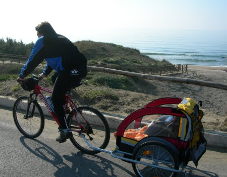
  

  

   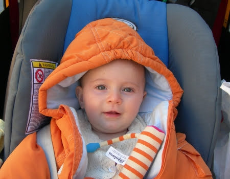
  

 

# Un giorno importante!
*11-02-2007*

 
  

   ciao amici,
  

  

   oggi è un giorno importantissimo perchè ho fatto tante cose nuove.
  

  

   Stamattina sono stata in piscina con MeP.
  

  

   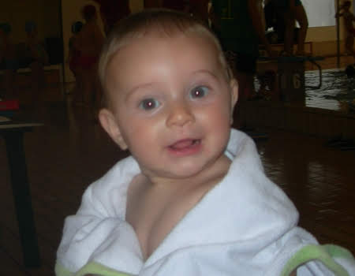
  

  

   Che bello tutta quell'acqua e i bimbi che mi guardavano e giocavano. Ho sguazzato come un pescetto per mezz'ora provando tutti gli stili ... pancia in su, in giù, morto a galla...!
  

  

   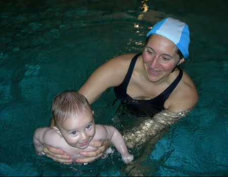
  

  

   Dopo la nuotata sono crollata in braccio al mio papà...guardate che nuotare è davvero stancante!
  

  

   Poi quando mi sono svegliata ero affamatissima e ho mangiato per la prima volta il brodo vegetale con la crema di riso....mi sono sbafata quasi tutto il piatto! Ho preso tutto dal mio papà ! :)
  

  

   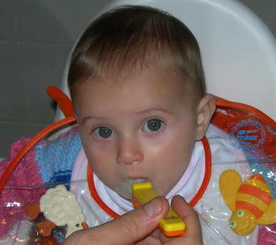
  

 

# Alle terme di Viterbo
*17-02-2007*

 
  

   Ciao, ieri P doveva lavorare a Viterbo e dunque M, nonno Gianni ed io abbiamo approfittato per andare alle terme dei Papi. Poi P e Silvia ci hanno raggiunto e super mega bagnetto... che calduccio, proprio piacevole, io e il mio costumino con Nemo abbiamo spopolato...
   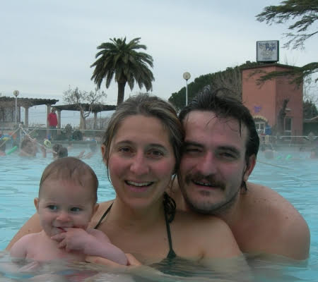
  

  

   Se non fosse che ad un certo punto ho bevicchiato e ... blah quell'acqua c'ha un saporaccio ;-)
  

 

# Auguri MeP
*21-02-2007*

 
  

   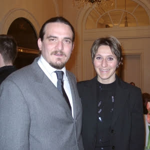
  

  

   Sono passati ben 5 anni da quando la mia mamma e il mio papà si sono dati il primo bacio....quante cose sono successe ...M si è laureata con un proff fighissimo (hihihihi)
  

  

   , hanno preso il brevetto di parapendio, sono andati a vivere insieme, hanno vinto un bronze award ad un concorso mondiale, hanno comprato il camper, hanno fatto il giro dell'austria in bicicletta,  e adesso, ultima ma più importante.... hanno fatto una figlietta meravigliosa....che sarei io! ;)
  

 

# Un bacio a Lulù
*21-02-2007*

 
  

   ciao lulù,
  

  

   anche io ho lo stesso struzzo verde....a me piace un sacco mordergli il collo!
  

  

   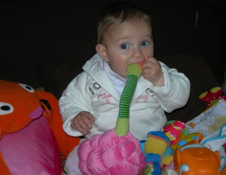
  

  

   Bello il tuo blog
  

  

   http://luluontheweb.blogspot.com/
  

  

   verrò a visitarlo spesso. :)
  

 

# Sondaggio: SCARPE che passione!
*25-02-2007*

 
  

   La mia mamma ne ha almeno una cinquantina e io non potevo che ereditare questa passione!
  

  

   Infatti ho più scarpe che mesi! :D
  

  

   Quale vi piace di più? Lasciate il vostro commento e alla fine vi dirò quale è la mia preferita!
  

  <table>
   <tr>
    <td>
     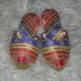
    </td>
    <td>
     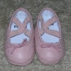
    </td>
    <td>
     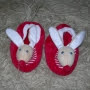
    </td>
    <td>
     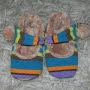
    </td>
    <td>
     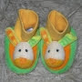
    </td>
    

    

   </tr>
   <tr>
    <td>
     turkish
    </td>
    <td>
     etoile
    </td>
    <td>
     christmas
    </td>
    <td>
     fashion
    </td>
    <td>
     conigliose
    </td>
    

    

   </tr>
   <tr>
    <td>
     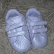
    </td>
    <td>
     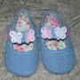
    </td>
    <td>
     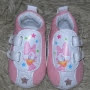
    </td>
    <td>
     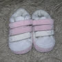
    </td>
    <td>
     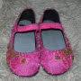
    </td>
    

    

   </tr>
   <tr>
    <td>
     sport
    </td>
    <td>
     figliadeifiori
    </td>
    <td>
     paperina
    </td>
    <td>
     everyday
    </td>
    <td>
     etnico
    </td>
    

    

   </tr>
  </table>
 

# Tlin....un dentino!
*25-02-2007*

 
  

   Hei ecco perchè questi giorni ero un pò stranitella....è uscita fuori dalla mia gengiva una piccola puntina bianca...MeP dicono che si chiama 'dentino' e che potrò usarlo per mangiare tante cose buone e croccanti e per dire le parole difficili, tipo ZIA! :)
  

  

   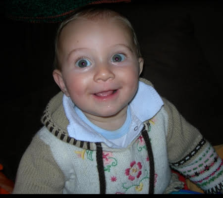
  

 

# Zio Gianluca e zia Angela
*28-02-2007*

 
  

   Ieri sera sono venuti a trovarmi e mi sono divertita un mondo.
A prestissimo zietti.
  

  

   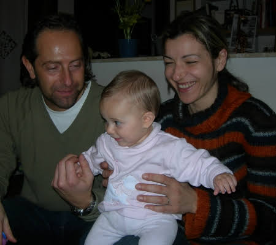
  

 

# Mezzo anno!
*08-03-2007*

 
  

   Oggi compio 6 mesi! Ne ho fatte di cose in questo mezzo anno eh?
  

  

   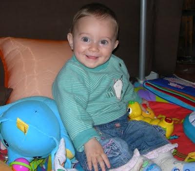
  

  

   N.B. Auguri anche alla mia gemellina Toporosa :)
  

 

# La torta
*09-03-2007*

 
  

   Non ho ben capito perchè tutti la mangiavano ed io ho potuto solo imbrattarmi un pochino le mani, però mi sa che in futuro le cose cambieranno ... "noi siamo piccoli, ma cresceremo e allora virgola" ...
  

  

   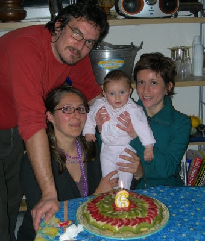
  

 

# Un saluto alla mia amica Silvia
*09-03-2007*

 
  

   In Svizzera fa freddo, ma noi sappiamo come riscaldarci in Italia... con l'acqua calda.
  

  

   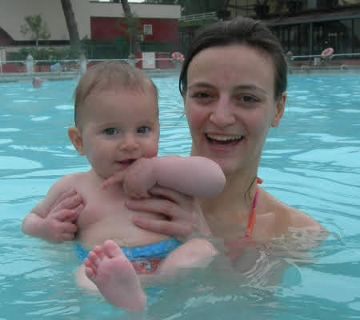
  

  

   Ciao Silvia .. a prestissimo.
  

 

# BRUM BRUM sulla mia coccinella sprint
*09-03-2007*

 
  

   Oggi si va in moto sulla mia coccinella sprint
  

  

   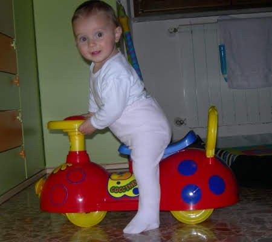
  

  

   ... e vediamo chi riesce a starmi dietro!!!
  

 

# TOPOROSA con un nuovo look !!! 
*10-03-2007*

 
  

   Ciao Matilde !!! Volevo mandare un salutone grande grande a te e ai tuoi MeP...e poi vi volevo anche far vedere il mio nuovo look ...hihihi...che ne pensate ? Aspetto i vostri pareri
  

  

   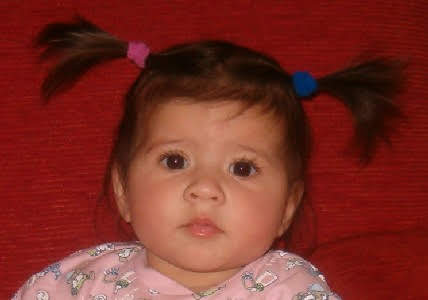
  

  

   Un bacione da Alessia
  

 

# Le dejeuner sur l'erbe
*14-03-2007*

 
  

   In occasione del compleanno di Nathalie, la mamma della mia amica Popì, siamo state a fare una passeggiata in centro. Abbiamo visto il colosseo (in verità Popì ha cercato di svegliarmi per ammirarne la bellezza, ma l'aria primaverile e i san pietrini contribuivano a facilitare il mio sonno)
  

  

   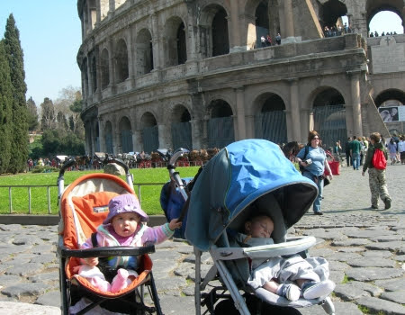
  

  

   e poi abbiamo pranzato su un bel prato di margherite.Ha tutto un altro sapore la pappa fatta cosi'! ;)
  

  

   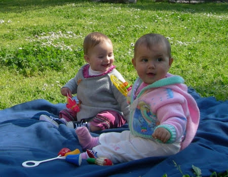
  

  

   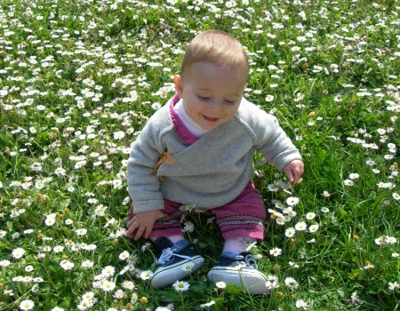
  

 

# BUON ONOMASTICO MATILDE !!!
*15-03-2007*

 
  

   Ciao Matilde ! La mia mamma ha letto sul calendario che oggi è S. Matilde!! Per festeggiare fatti portare sulle giostre dalla tua mamma :-)
  

  

   . Io ci sono stata ed è stato proprio bellissimo ...tante luci, suoni, colori e mentre la giostra girava mi potevo impicciare di tutto hihihi :-D
  

  

   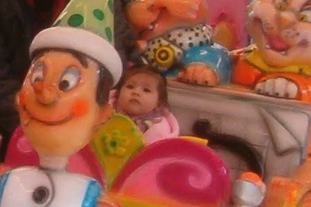
  

  

   Io intanto ti mando un bacione e un abbraccio grande grande :-D Tanti auguri !!! T.V.B. Toporosa
  

  

   p.s. Auguri anche dai miei MeP
  

  

   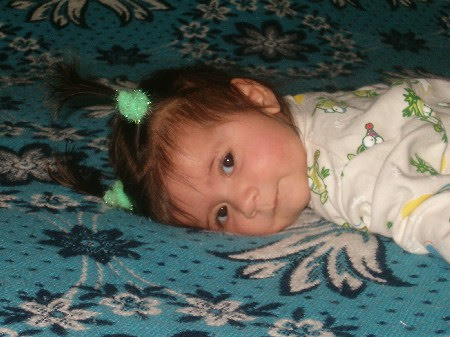
  

 

# Benvenuta Lola
*16-03-2007*

 
  

   Un'altra amichetta... ma chi ci fermerà quando usciremo tutte insieme!!!
  

  

   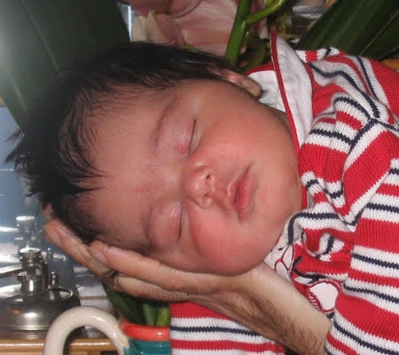
  

  

   Benvenuta Lola e un grosso abbraccio a mamma Gaia e papà Gianpaolo.
  

 

# A spasso con nonna Franca
*17-03-2007*

 
  

   Oggi ho inaugurato il passeggino che useranno i nonni per portarmi a spasso.
  

  

   Sono stata con nonna Franca in un bel posto pieno di alberi e un verdissimo prato.
  

  

   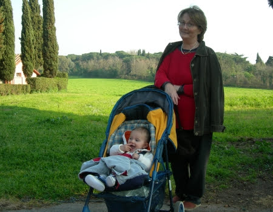
  

 

# Matrimonio combinato
*17-03-2007*

 
  

   Il papà di Paolo e il mio stanno combinando il nostro matrimonio.....
  

  

   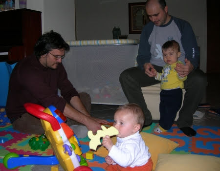
  

  

   ma insomma vi sembra giusto?Potrò decidere io?Anche perchè a luglio arriverà un nuovo amichetto e la scelta aumenta :)
  

  

   Vi ricordate Pina,la gemellina della mia mamma che è attulamente panzuta?Bè è un maschietto.....anzi se avete suggerimenti per il nome lasciatemi il vostro commento....aiutiamo Pina e Gianluca a scegliere un nome per il loro bimbo!
  

 

# Il parapendio,la bici e la sabbia
*22-03-2007*

 
  

   Questo fne settimana ho fatto molte cose, sono stata a Norma a vedere i parapendii, e mi sono anche seduta nella selletta di Nospa,
   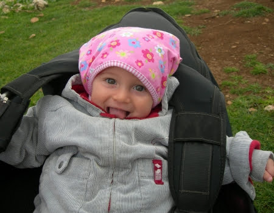
  

  

   poi ho fatto un giro in bicicletta con MeP a Sabaudia
  

  

   
  

  

   e infine dopo una sostanziosa pappa in riva al mare ho fatto una passeggiata sulla spiaggia
  

  

   
  

  

   ....che bello mettere i piedini nudi sulla sabbia!
   
  

 

# 'na birretta
*30-03-2007*

 
  

   Per il compleanno di papà me so fatta 'na birretta .... mica male!
   
  

 

# Pasqua nelle Marche
*12-04-2007*

 
  

   Sono andata a trovare la mia sbinonna nelle Marche.
   
  

  

   Abbiamo fatto mille passeggiate e quei monti sono proprio belli, però il sole mi da un pochino fastidio e dunque MeP mi hanno comperato gli occhiali... moooolto diva!
  

  

   
  

  

   La camminata mi ha stancata e mi sono riposata sul prato di nonna Maria tra le margherite. Poichè i capelli ormai sono lunghi e fluenti, mamma mi ha messo le mollette ;-)
  

  

   
  

  

   Però il sole era davvero troppo e allora ecco il mio cappellino.
  

  

   
  

  

   Comunque non dimetichiamoci che era Pasqua e allora ecco il mio approccio all'uovo... per il momento è troppo grande, ma ricordatevi ...
   <em>
    noi siamo piccoli, ma cresceremo ...
   </em>
  

  

   
  

  

   Buona Pasqua a tutti, ma proprio tutti tutti.
  

 

# Auguri Paolo
*13-04-2007*

 
  

   ciao amici, oggi Paolo (anche detto l'Imperatore)
  

  

   compie il suo primo anno!
  

  

   MILLE E MILLE AUGURI
  

  

   
  

 

# Pesce d'Aprile
*13-04-2007*

 
  

   Mammina, anche se in ritardissimo ti faccio tanti auguri di compleanno...
  

  

   [
   
  

  

   ](http://pilde.net/blog/?attachment_id=257)
  

  

   ...eppoi te li ho fatti in ritardo perchè ... è un pesce d'Aprile, come te!
  

 

# Pesce d'Aprile
*13-04-2007*

 
  

   Mammina, anche se in ritardissimo ti faccio tanti auguri di compleanno...
  

  

   [
   
  

  

   ](http://pilde.net/blog/?attachment_id=257)
  

  

   ...eppoi te li ho fatti in ritardo perchè ... è un pesce d'Aprile, come te!
  

 

# Chi è in acqua?
*16-04-2007*

 
  

   [
   
  

  

   ](http://pilde.net/blog/?attachment_id=259)
  

 

# Mascot del club
*19-04-2007*

 
  

   Quali migliori mascot dei 'paranormali' (www.paranormali.net)
  

  

   se non due bimbi addormentati in decollo sotto la giacca del club?
  

  

   
  

 

# Evviva il girello!
*25-04-2007*

 
  

   Quei mattacchioni degli amici di mamma (cianchino, mario, peppone, ile, silvia e flo)
  

  

   mi hanno regalato un fantastico girello!
  

  

   Ci hanno impiegato un'ora per montarlo, leggevano le istruzioni al rovescio ;)
  

  

   ,ma alla fine sono riuscita a fare la mia prima corsa per il corridoio!
  

  

   Che forza! :)
  

  

   
  

 

# Il varo di Rolabagna
*27-04-2007*

 
  

   Lago di Bracciano!
Ci svegliamo in camper con vista panoramica e andiamo a fare una bella colazione al sole sul lungo lago di Trevignano con Bruno e Noemi.
   
  

  

   Mentre i maschietti fanno un pò di lavori per rimettere a posto la barca io mi godo il sole!
   
  

  

   E' tutto pronto per il varo di Rolabagna! Finalmente dopo mesi tra gli ulivi la mia povera barchetta rivede l'acqua!
  

  

   
  

  

   La prossima volta però vado a fare un giro anche io! ;)
  

  

   
  

 

# Toc Toc
*13-05-2007*

 
  

   Per entrare nella mia cameretta, dovete bussare la coccinella di Nathalie... dicono mi somigli. Ciao
  

  

   
  

 

# Un pò di aria ligure
*15-05-2007*

 
  

   Lo scorso fine settimana sono stata a Borgio Verezzi a trovare tutti gli amici della mia famiglia che l'anno scorso mi hanno vista dentro la pancia di mamma!Lucia, Luciano, Piera, Piero, Giuliano, Dea, Maurizio.
  

  

   
  

  

   Un bacio grande a tutti!
  

  

   
  

 

# Weekend in barca!
*15-05-2007*

 
  

   Che bello finalmente anche io ho fatto un giro su Rolabagna! Mi hanno messo un coso buffo addosso tutto arancione e con un fischietto, ma io stavo con la mia mamma e non avevo paura di niente, anzi ridevo (come al solito)
  

  

   ! :D
   
  

  

   ...e poi al timone c'erano capitan Gianluca e il mio papà !
  

  

   
  

  

   La zia Pina e il piccolo Flavio nella pancia invece si sono goduti il sole e gli schizzi d'acqua!
  

  

   
  

  

   
  

  

   Domenica mattina siamo stati a fare colazione col pedalò con Bruno e Noemi (che fatica pedalare a stomaco vuoto!)
  

  

   
  

  

   e nel pomeriggio sono venuti a trovarmi tantissimi amici: Sophie, Nicole, Lulù, Ludovica, Emilia e ho conosciuto Teresa.
  

  

   
  

 

# 18227
*21-05-2007*

 
  

   Oggi ero alle terme di Caracalla a correre... 18227 è il numero del mio pettorale alla corsa "race for the cure".
  

  

   
  

  

   ... chi correva e chi camminava... io stavo in bici con mamma e papà ci correva dietro :-P ...
  

  

   
  

  

   Che bella Roma così, tutti a piedi gioiosi e sorridenti, senza clakson e smog, ma perchè non lo facciamo sempre?
  

 

# Tanti auguri Nasla!
*26-05-2007*

 
  

   ciao Nasla,
  

  

   mille e mille auguri per i tuoi 16 anni! Ci vediamo al mare quest'estate!
  

  

   
  

 

# Budino è tornato in famiglia
*27-05-2007*

 
  

   Oggi siamo contenti.
  

  

   Ci hanno scritto una   lettera per dirci che Budino è finalmente tornato in famiglia.
   
  

  

   Fratellino, in bocca al lupo, noi saremo sempre con te.
  

  

   Un abbraccio.
  

 

# Un tuffo in piscina
*03-06-2007*

 
  

   Domenica mattina sono andata in piscina con le mie amichette Nicole e Sophie.
  

  

   Ci siamo divertite con i tunnel e le palline e poi insieme alla mia insegnante Alessandra ho anche fatto il mio primo tuffo! Sono andata sott'acqua! Che forza!
  

  

   
  

  

   Dopo la piscina siamo andate sull'altalena!
  

  

   
  

  

   
  

 

# Un tuffo in piscina
*03-06-2007*

 
  

   Domenica mattina sono andata in piscina con le mie amichette Nicole e Sophie.
  

  

   Ci siamo divertite con i tunnel e le palline e poi insieme alla mia insegnante Alessandra ho anche fatto il mio primo tuffo! Sono andata sott'acqua! Che forza!
  

  

   
  

  

   Dopo la piscina siamo andate sull'altalena!
  

  

   
  

  

   
  

 

# Ciaooo MATILDE !!!!
*05-06-2007*

 
  

   Ciao Matilde, sono Toporosa come te la passi ?? Ancora non siamo riuscite a vederci per colpa di quella panzona di mamma :-(
  

  

   
  

  

   Io sono sempre più pestifera e tu li fai impazzire bene i tuoi MeP ??? Noi vi pensiamo sempre , e voi ??
  

  

   
  

  

   Anche mamma vorrebbe farmi un blog come il tuo così tutti gli amici possono lasciarmi tanti messaggi .... ma voi che ne pensate ??? E' troppo tardi ??? Tanti bacioni e tante ciucciatone ai tuoi giochini !!!! TOPOROSA
  

 

# Il terzo dente!
*07-06-2007*

 
  

   Evviva!Ieri è uscito il mio terzo dente!E che dente!Finalmente posso addentare meglio tutto quello che mi capita a tiro! :)
  

  

   
  

 

# Mi è venuta a trovare Lulù
*07-06-2007*

 
  

   Qualche giorno fa mi è venuta a trovare Lulù e si è ciucciata tutti i miei pupazzetti!
  

  

   
  

 

# 9 mesi :)
*08-06-2007*

 
  

   Oggi è il mio complemese...ma uno di quelli importanti!Finalmente posso dire che ho passato più tempo fuori che dentro la pancia della mia mamma!
  

  

   Auguri Augurissimi anche alla mia gemellina Toporosa sdentata! :)
  

  

   
  

 

# Toporosa Bloggata!
*08-06-2007*

 
  

   Evviva con grande gioia vi annuncio che anche la mia gemellina Toporosa da oggi ha il suo bellissimo blog!
  

  

   Andatelo a vedere!
  

  

   <a href="http://ilblogdialessia.blogspot.com/">
    http://ilblogdialessia.blogspot.com/
   </a>
  

 

# Architettettando...
*14-06-2007*

 
  

   Zia Betta stava già architettando qualcosa, d'altronde è la sua professione...
  

  

   
  

  

   ... però ieri ce l'ha comunicato...
   <strong>
    ha aperto il suo studio.
   </strong>
  

  

   Che ficata, sono proprio contenta per te zietta. Non son bene cosa si dica in queste occasioni ma te lo dico a modo mio... "DEDE DE DEDEDEDE BA.... BA... DE!". Insomma augurissimi, case belle e intelligenti e clienti facoltosi. A proposito se aveste bisogno di un architetto....
Un bacio zietta.
  

 

# Grazie zia Giorgia!
*16-06-2007*

 
  

   Ciao zia,
so che sei lontana adesso e volevo ringraziarti per le bellissime giornate che abbiamo passato insieme.
  

  

   Mi hai insegnato a fare dei suoni buffi e mi sono sempre sganasciata dalle risate con te!
  

  

   Ci vediamo presto! :D
  

  

   scuffu di zia
  

  

   
  

 

# In campagna
*16-06-2007*

 
  

   Sabato sono stata in campagna dai nonni! Ho fatto un pò di trekking con papà (comoda la vita eh ;)
  

  

   )
  

  

   
  

  

   e poi mi sono rilassata con la sbinonna (fa dei versi buffissimi e io a volte rimango un po' perplessa!)
  

  

   
  

  

   Ho mangiato tanta pastina
  

  

   
  

  

   e poi con zia Giorgia e Francesca mi sono fatta un giro sull'amaca del nonno!
  

  

   E' proprio un furbacchione il nonno, dice che se ne va in campagna a lavorare e a sudare e poi ha un'amaca bellissima al fresco degli ulivi....mhhh...chissà...VIVA i PENSIONATI!!
   
  

 

# Weekend al circeo
*18-06-2007*

 
  

   Che serata ragazzi! Ho mangiato per la prima volta il cocomero e P mi ha anche fatto l'iniziale con la buccia, una bellissima M verde! (è anche l'iniziale di Mara :)
  

  

   )
  

  

   
  

  

   poi abbiamo giocato a 'batti il cinque' con Lorenzo
  

  

   
  

  

   e infine esausta sono andata a casa in moto con Trota (non ditelo a MeP)
  

  

   
  

  

   Stamattina invece ho fatto il bagnetto al mare! l'acqua era un po' freddina ma il mio papino mi stringeva forte forte e non avevo freddo, anzi ridevo...tanto per cambiare! :D
  

  

   
  

 

# Sono nati i gemellini!
*24-06-2007*

 
  

   Ieri alle 14.30 sono nati i gemellini Alessio e Valerio! Auguri a mamma Laura e papà Fabrizio.
  

  

   Non vedo l'ora di conoscervi!
  

 

# Tra le nuvole!
*26-06-2007*

 
  

   Domenica mattina, 8.40, passo il check in senza problemi (strano avevo del liquido altamente infiammabile nel mio biberon)
  

  

   ....ed eccomi sull'aereo in direzione sud verso catania!Ho chiaccherato con il mio vicino di poltrona, ho bevuto l'acqua in decollo e poi sono sprofondata nel sonno fino all'atterraggio!
  

  

   
  

 

# A Catania!
*26-06-2007*

 
  

   Eccomi a Catania finalmente!Sono dalla zia maria...mi sono rinfrescata nel suo bagno
  

  

   
  

  

   e poi ho fatto una bella passeggiata a S.Giovanni Licuti.
  

  

   Stamattina sono andata al mare con i nonni e mamma alla pineta del Gelsomineto, dopo essermi mangiata una fantastica granita alle mandorle!
  

  

   
  

  

   Ho fatto il bagno con la mia nuova tartaruga verde. L'acqua era calda e bellissima.
  

  

   
  

 

# A Salina
*04-07-2007*

 
  

   L'altro giorno eravamo alla Plaja di Catania e zia Maria ci ha proposto di andare un paio di giorni a Salina a trovare Bianca. Si, dai, andiamo.
Qualche vicessitudine all'imbarco, perchè non abbiamo potuto imbarcare la macchina, ma poi tutto a posto... si parte comunque, e dopo un'oretta di aliscafo arriviamo a Salina. Ci accoglie Bianca, è proprio tanto simpatica e ci troviamo subito benissimo.
   
  

  

   Povero P, si è trovato tra un branco di donne... Bianca, Gabriella, zia Maria e M... ed è stato costretto a provare tutti i manicaretti che gli proponevano... sai, per non contrariarle ;-)
  

  

   
  

  

   La casa di Bianca è splendida, un posto dove è bello stare dall'alba al tramonto.
  

  

   
  

  

   
  

  

   Con MeP abbiamo fatto un giretto dell'isola... è proprio bella. Dal mare ai monti in pochissimo spazio, eppoi lo Stromboli in lontananza e le altre isole, le barche a vela, le stelle, i gabbiani, i colori e la luce, il vento i ciottoli, le felci e i porri...
   
  

  

   Catania o Salina, Salina o Catania ... non saprei cosa scegliere
  

  

   
  

  

   Vabbè, me le godo tutte e due.
  

 

# Piscinetta!
*06-07-2007*

 
  

   Eccomi nella mia piscinetta nella spiaggia più bella della sicilia (dice la nonna)
  

  

   , al gelsomineto di cassibile!
  

  

   
  

  

   Dove, oltre ai bagni, faccio anche tanti castelli di sassi con il nonno
  

  

   
  

  

   Ciao P, dai che tra qualche giorno ci rivediamo!Mi manchi sai :)
  

 

# 7-7-7
*08-07-2007*

 
  

   Il 7 ha un significato particolare per noi.
  

  

   Io sono nata il 7, MeP sono 7 dipendenti eppoi... i nani sono 7...
  

  

   
  

  

   anche io sono una nanetta, ma crescerò!
  

  

   
  

 

# A Punta Izzo
*13-07-2007*

 
  

   Ho trascorso due bellissimi giorni al centro elioterapico della Marina in mezzo a vecchi ammiragli e giovani ufficiali....ma per fortuna c'erano la zia Anna Gloria, lo zio Nic e Camilla.
  

  

   
  

  

   Ho fatto tanti bagni anche se l'acqua era un pò freddina e ho imparato a salire le scale!
  

  

   
  

  

   
  

 

# Una giornata con Toporosa
*14-07-2007*

 
  

   Ho trascorso una bellissima giornata con la mia gemellina.In realtà dopo esserci alternate nelle ninne siamo riuscite finalmente a giocare un po' insieme al parco.Ha dei giochini fantastici Toporosa e una palmetta in testa irresistibile!
   
  

  

   Siamo anche andate insieme sulle giostrine, io guidavo il delfino e lei stava aggrappata a me!
  

  

   
  

  

   Poi abbiamo cenato insieme e siamo state a giocare nel suo box, lei mi si è sdraiata addosso e io le ho morso un dito e il sedere!
  

  

   Ognuno socializza a modo suo! ;)
  

 

# Pesi e misure
*14-07-2007*

 
  

   Secondo il Sistema Internazionale, alla soglia dei miei 10 mesi, sono alta 75 cm e peso 8,2 Kg!
  

  

   
  

  

   ....e so anche guidare la macchina! :)
  

  

   hihihihi
  

 

# Io so una cosa, ma...
*15-07-2007*

 
  

   
  

  

   ... eppoi auguri a zio Daniele, oggi è il suo compleanno ;-)
  

 

# Ecco Flavio!
*17-07-2007*

 
  

   Sabato sera, il 14, è nato il piccolo Flavio!
  

  

   Un abbraccio alla neo super mamma Pina e a papà Gianluca
  

  

   
  

 

# Auguri nonna Lilli
*17-07-2007*

 
  

   Ciao nonnina,
  

  

   tanti auguri di buon compleanno!
  

  

   
  

 

# Hola tio Carlo
*22-07-2007*

 
  

   El primero dia que estoy con mi tio Carlo y ya se comio mi comida y mi yogurt. Pero todavia te quiero mucho!!!
  

  

   
  

  

   
  

 

# Hai capito er muffone!
*24-07-2007*

 
  

   Se dovessi trovare uno slogan per quest'anno direi "anno di case e bambini". Ieri siamo stati da Bruno e Noemi e abbiamo finalmente conosciuto er Muffone, la loro nuova casetta.
  

  

   
  

  

   A me non mi sembra per niente un Muffone, è proprio bellissima. Bravi bravi bravi... c'ho avuto il lampo di genio, da Bravo Bravo a Bravi Bravi ;-)
  

  

   Eppoi c'è il posto per la mia piscinetta e si sa, io non so resistere.
  

  

   
  

  

   PeròP e Bruno hanno fatto un sacco di polvere e così alla fine mi sono fatta anche una doccetta.
  

  

   
  

  

   Ciao Bravi Bravi e a prestissimo.
  

 

# Maia
*30-08-2007*

 
  

   Volevo fare un saluto speciale a Maia, una cagnetta tanto bella e dolce quanto sfortunata.
  

  

   Adesso lei sta giocando con tanti altri cagnetti nel paradiso dei cani, ma rimarrà  sempre nei nostri cuori e in particolare in quello di zia Giorgia.
  

  

   
  

 

# Nelle Marche dai nonni
*30-08-2007*

 
  

   ....e continua la mia vacanza estiva...sono andata a trovare i nonni Mario e Franca nelle Marche.
  

  

   Siamo partiti con il camper e ci siamo portati la sbinonna Maria di Roma, cosi' adesso sono tutte e due insieme le sbinonne marie! La sera fanno le ore piccole, se ne vanno a spasso con le amiche per il paese....hai capito!Alla faccia degli 86 anni ciascuna!
  

  

   
  

  

   Abbiamo fatto qualche passeggiata nel bosco e ho conosciuto tanti parenti.
  

  

   
  

  

   Poi nel weekend sono arrivati anche la zia Betta e lo zio Daniele....bhè avevano un annuncio importantissimo da fare....vi ricordate il mio post di qualche giorno fa? le tre scimmiette? Ebbene si, tra le lacrime, il vino e la crescia hanno dato l'annuncio...presto avrà un CUGINETTO!!!!!! EVVIVA! Ci hanno prorpio colti di sorpresa con questa bellissima notizia!
  

  

   
  

 

# Croazia - parte 1 
*30-08-2007*

 
  

   ...e la vacanza continua!
  

  

   Ci siamo imbarcati il 1 Agosto su una nave grande grande diretta in croazia, a Zara. Appena arrivati siamo subito andati a fare conoscenza con le spiagge della zona....
  

  

   
  

  

   ...ottimi sassi e pigne anche qui!
  

  

   
  

  

   Poi abbiamo visitato una chiesina minuscola, a mia misura
  

  

   
  

  

   e Nin, paesino tra le mura. Qui abbiamo incontrato le prime gocce d'acqua....che ci hanno fatto spesso compagnia in vacanza!
  

  

   
  

  

   Strada facendo siamo arrivati sull'isola di Pag, tantissimo vento e un paesaggio lunare, molto bella!
  

  

   
  

  

   Ma mica abbiamo fatto solo mare! Siamo anche andati a visitare dei parchi nazionali.Qui eravamo a Paklenica.
Devo dire che mi affaticavo molto sulle spalle di papà ! ;)
  

  

   
  

  

   La sera poi ci godevamo spesso dei tramonti bellissimi, durante i quali di solito mi addormentavo!
   
  

  

   E comunque, durante questa vacanza, ho scoperto la mia indole riflessiva....
  

  

   
  

 

# I gemellini!
*30-08-2007*

 
  

   Non poteva mancare una tappa a S. Benedetto del Tronto, prima della partenza per la Croazia, per andare a conoscere i gemellini Alessio e Valerio! Sono bellissimi! Vicino a loro sembravo così grande :D
  

  

   
  

 

# Croazia - parte 2 
*30-08-2007*

 
  

   ....continua.....
  

  

   non poteva mancare la visita al parco nazionale di Plitvice, tantissimi laghetti e cascate che si possono attraversare su pontili di legno (non sul passeggino pero'! ;)
  

  

   Una vera immersione nella natura!
   
  

  

   e da bravo animaletto ho anche imparato a torturare mamma!
  

  

   
  

  

   
  

  

   
  

  

   La mattina presto in campeggio mi piaceva fare il bagno quando l'acqua era ancora fredda...ma c'era davvero l'acqua?
  

  

   
  

  

   Ho imparato anche a bere dalla cannuccia come i grandi!
  

  

   
  

  

   Da bravi turisti siamo riusciti a farci fregare con la foto 'caratteristica'!:)
  

  

   
  

  

   Poi abbiamo abbandonato la terra ferma per le isole di Krk e Cres, e sul traghetto ero irresistibile con i miei occhialini!
  

  

   
  

  

   Sulla bellissima spiaggia di Valun abbiamo raccolto tanti sassi e mangiato ottimo pesce!
  

  

   
  

  

   
  

  

   
  

  

   A Fiume abbiamo visto una costruzione bellissima...mumble mumble....mi ricordava qualcosa :)
  

  

   
  

  

   Per la gioia di P siamo andati a visitare il parco nazionale delle Isole Briuni, ehm.... bello per carità ...ma un 'pelino' turistico!
  

  

   
  

  

   Però lì ho realizzato che potevo stare in piedi da sola! Che forza!
  

  

   
  

  

   E il giorno dopo, in Istria, a Rovigno ho fatto i miei primi passi da sola, attirata da un signore che mi faceva tanto ridere!
  

  

   Mamma si è commossa! Sto prorpio diventando grande!
  

  

   
  

  

   E così è finito il mio primo vero viaggio all'estero! Arriveduar Croazia!
  

  

   
  

 

# Primo giorno al nido
*04-09-2007*

 
  

   Oggi è un giorno importante! E' il mio primo giorno di asilo nido.
  

  

   Sono andata al 'Casale dei Piccoli' in bicicletta con MeP.
  

  

   
  

  

   Il posto mi piace, a parte un bel giardino fuori, dentro c'erano tantissimi giochi e continuavano ad arrivare i bimbi.
  

  

   Ho giocato un po' con mamma, sotto lo sguardo vigile di papà ....
  

  

   
  

  

   .. poi ho subito preso confidenza e mi sono lanciata nelle public relations!
  

  

   MeP sono andati a fare una passeggiata, ma io nemmeno me ne sono accorta....avevo troppe cose da fare!
  

  

   
  

  

   Dopo un po' li ho visti affacciarsi al cancelletto della stanza dei giochi e mi hanno fatto tenerezza, sembravano tristi senza di me, cosi' sono andata da loro!
  

  

   Insomma questo primo giorno è andato benissimo :)
  

 

# Pedro
*05-09-2007*

 
  

   Ho conosciuto Pedro il cagnetto di Bruno e Noemi ... Che tipo, c'è un gran feeling tra di noi, e anche P se la gode.
  

  

   
  

 

# Un post dal passato ... rimasto in sospeso "è questione di sguardi"
*06-09-2007*

 
  

   
  

  

   Puzzetta e zia Betta
  

 

# Un anno dopo!
*08-09-2007*

 
  

   ....ed è già  passato un anno!!
  

  

   Tanti auguri a me...tanti auguri a me!
  

  

   
  

  

   Oggi ho festeggiato al nido con tanti bimbi e un trenino di candeline!Cercavo di acchiappare la fiamma con la manina e poi ho sbriciolato tutto il ciambellone in giro!Sono proprio una tempestina!
  

  

   
  

  

   P.S. Tanti auguri anche alla mia gemellina Toporosa
  

 

# 3 x 1 = ?
*09-09-2007*

 
  

   
  

  

   
  

  

   
  

 

# Quella "sporca" dozzina + 1
*10-09-2007*

 
  

   
  

  

   
  

  

   
  

  

   
  

  

   
  

  

   
  

  

   
  

  

   
  

  

   
  

  

   
  

  

   
  

  

   
  

  

   
  

  

   Grazie amici miei e arrivederci al prossimo anno :-D
  

 

# Un compleanno carico carico di...
*14-09-2007*

 
  

   ...di danze...
  

  

   
  

  

   ....di amache....
  

  

   
  

  

   ... di cappellini....
  

  

   
  

  

   ....di torte...
  

  

   
  

 

# Coccole
*14-09-2007*

 
  

   
  

 

# 49 (non 50)

volte bravo...
*18-09-2007*

 
  

   
  

  
  <ol>
   <li>
    va in ... bicicletta, 2 parapendio, 3 barca,  4 windsurf, 6 canoa, 7 delta, 8  kite, 9 snow-board, 10  cavallo, 11 ha una donna meravigliosa,12 ha ristrutturato il muffone,13  ha un cagnetto di nome Pedro,14 costruisce modellini di legno, 15 fa delle ottime pizze, 16 mi sbaciucchia sempre,..... 46 tric e trac, 47  mortaretti, 48 perepe, 49 auguri zio Bobo!!!!!!!
   </li>
  </ol>
 

# Torte e 2 ...chi offre di più?
*19-09-2007*

 
  

   L'altra sera Antonella ed Andrea mi hanno fatto un'altra torta ed io ho addirittura provato a spegnere la candelina, ma insomma, ancora ho qualche difficolta ...
  

  

   
  

  

   ... chi mi fa riprovare? ;-)
  

 

# x auguri alla zia Marotta
*22-09-2007*

 
  

   ....visto che l'età delle donne non si dice...
  

  

   BUON COMPLEANNO (scusa il ritardo :( )
  

  

   
  

 

# Pesi,misure e un nuovo look!
*23-09-2007*

 
  

   Tralasciando il peso (sono uno scricciolo, o come dice M un topo secco)
  

  

   , sono alta 77 cm, ho 10 denti e ho cambiato look (un'idea di P)
  

  

   ! Faccio tante cose buffe ultimamente: cerco di infilarmi i calzini e le scarpe da sola, mangio gli spaghetti, faccio lo scivolo al parco giochi (mi do anche la spinta)
  

  

   , rido come una matta quando la sbinonna fa l'altalena con me, infilo le chiavi nella toppa della porta per uscire, appena si nomina il bagnetto corro subito alla mia vasca, ballo e corro sul posto, faccio delle smorfie da grande,gioco a nascondino e acchiapparella e so dire 'bau', 'brum-brum' e 'pappa'.
   
  

 

# La mia prima malattia :(
*26-09-2007*

 
  

   ...anzi in realtà è la '
   <strong>
    sesta malattia
   </strong>
   ' (il virus HHV6)
  

  

   , ma per me è la prima!
Ho avuto la febbre per 3 giorni e poi ieri mi sono spuntate tante bollicine rosse.Però non sono fastidiose e di sicuro non mi hanno fatto perdere la voglia di giocare,ridere e scherzare!
  

  

   
  

 

# E' difficile mettersi le scarpe!
*28-09-2007*

 
  

   Io ci provo sempre...ma forse sbaglio qualcosa?
   
  

 

# Daniela
*28-09-2007*

 
  

   Amici vi presento Daniela, la mia baby sitter!
E' molto simpatica e insieme passiamo ore e ore a giocare...soprattutto in questi giorni che sono stata a casa malata!
  

  

   
  

 

# Sei forte papà!
*02-10-2007*

 
  

   Evviva! Il mio P ha vinto il concorso da ricercatore alla Sapienza!
Finalmente un dipendente della pubblica amministrazione!
Sei troppo forte papà!
   
  

 

# Le ninne!
*03-10-2007*

 
  

   M dice che dormo nelle posizioni più strane e che durante la notte giro come una trottola nel letto ...che ne dite?
  

  

   
  

  

   ogni tanto abbraccio il mio orsetto Tori, è morbido morbido!
  

  

   
  

 

# Auguri Tommaso!
*03-10-2007*

 
  

   Ciao Tommaso mille e mille auguri per il tuo primo compleanno!
  

  

   
  

 

# A cena dalla zia Marotta
*03-10-2007*

 
  

   ..come al solito ottima e abbondante magnata...e poi c'erano le mie amichette Sophie e Nicole e abbiamo giocato insieme a rincorrerci sotto il tavolo e a colorare gli animali di carta che faceva P.
  

  

   
  

  

   
  

  

   Poi la zia Marotta ha spento le candeline...anche lei quest'anno ha festeggiato tantissime volte come me! :)
  

  

   
  

 

# 2 Ottobre: festa dei nonni
*05-10-2007*

 
  

   Il 2 ottobre è stata la festa dei nonni!
Io ho fatto un bel lavoretto al nido: un cuore rosso di cartoncino con dei pois dipinti con le mie piccole dita! 
Poi ho invitato i nonni a cena e gliel'ho regalato!Sono proprio una nipotina speciale :)
  

  

   
  

 

# Le mollette!
*06-10-2007*

 
  

   Ho una passione per le mollete, anche perchè M me le mette da quando ero piccolissima e senza capelli! (ma come facevano a reggersi?)
  

  

   Ne ho accumulate un bel pò....queste sono le mie preferite!
  

  

   
  

 

# La mia cameretta
*06-10-2007*

 
  

   Oggi voglio farvi vedere la mia cameretta.
Per me è speciale perchè MeP l'hanno disegnata e colorata con tanto amore prima che nascessi....e poi adesso io la metto in disordine con altrettanto amore!
Questo è l'angolo dove passo più tempo (quando piove e sono costretta a stare a casa!)
  

  

   , un tappetone morbido e colorato e tantissimi giochi....
  

  

   
  

  

   ... a tenermi compagnia ci sono Elmer (l'elefante patchwork)
  

  

   , la sua amica Rose (l'elefante rosa)
  

  

   , Mix l'animale buffo sull'abero (un incrocio di scimmia,koala,papera che ha disegnato M)
  

  

   e gli uccellini blu
  

  

   
  

  

   e poi c'è il mio lettino dove faccio delle ninne fantastiche, la poltrona dove si siedono MeP quando mi vogliono fare qualche carezza mentre dormo (io faccio finta di dormire ma lo so che stanno lì vicino a me!)
  

  

   , e il metro-giraffa.
  

  

   
  

  

   Insomma vi piace la mia cameretta?
  

 

# Vaccino
*09-10-2007*

 
  

   Stamattina M mi ha detto che dovevo fare il vaccino, ma io ho capito 'bacino' e le ho mandato un sonoro smack...e lei si è messa a ridere!
Così dopo una passeggiata al mare con zia Giorgia ...
  

  

   
  

  

   ...sono stata a fare il vaccino, il terzo richiamo dell'esavalente! Sono stata bravissima, nemmeno un pianto, ho solo guardato male la dottoressa, ma poi dopo le ho fatto un sorriso.
  

 

# Un nonna mago?
*09-10-2007*

 
  

   La mia testa che sbuca da un cesto? E' magia?
  

  

   
  

  

   naaaaaa .... svelato il mistero....è quella burlona della nonna Lilly che mi ha infilata nel cesto pakistano!
  

  

   
  

 

# Mangio da sola
*12-10-2007*

 
  

   Con la mia forchettina nella mano sono riuscita ad infilzare e a mangiare la pasta col broccolo!
  

  

   
  

 

# 20 Ottobre: 32imo anniversario
*22-10-2007*

 
  

   ciao nonna Lilly e nonno Gianni buon anniversario di matrimonio!
Godetevi questo bel week end a Londra!
  

  

   
  

 

# A cena da Toporosa
*23-10-2007*

 
  

   Ieri sera sono andata a cena dalla mia gemellina Toporosa.
  

  

   
  

  

   E' stata una serata divertente e movimentata! All'inizio le levavo e le rimettevo il ciuccio...
  

  

   
  

  

   Ho fatto Ercolina spingendo avanti, indietro e per aria la sua poltroncina. 
Poi mentre i grandi mangiavano ci siamo messe a giocare per conto nostro e quando nessuno ci guardava le ho dato un bel pizzicotto sulla guancia...  e lei si è incavolata! :( 
...dato che è un pò 'rosicona' mi ha tenuto il muso......ma dopo abbiamo ripreso a giocare con dei nastrini e abbiamo fatto pace!
(anche se ripensandoci era ancora un pò arrabbiata con me!)
  

  

   
  

  

   Inoltre le ho impuzzolentito tutta la casa (la mattina mi sono fatta una bella bevuta di shampoo che mi ha ripulito l'intestino con ovvie conseguenze ;)
  

  

   )
  

 

# Auguri Cicia!
*23-10-2007*

 
  

   Mille e mille auguroni di buon compleanno a Francesca (meglio nota come Cicia!)
  

  

   
  

  

   Quando vieni a trovarmi che ci facciamo una bella foto insieme?
  

 

# Auguri Cicia!
*23-10-2007*

 
  

   Mille e mille auguroni di buon compleanno a Francesca (meglio nota come Cicia!)
  

  

   
  

  

   Quando vieni a trovarmi che ci facciamo una bella foto insieme?
  

 

# A spasso
*26-10-2007*

 
  

   Lo scorso fine settimana abbiamo fatto delle belle passeggiate con MeP. Sabato siamo stati al porto di Ostia (che conosco benissimo ormai!)
  

  

   
  

  

   ho anche mangiato il gelato da sola
  

  

   
  

  

   e ho giocato con i sassolini (sempre più coperta perchè si era alzato un bel ventone)
  

  

   .
  

  

   
  

  

   Domenica invece siamo stati a spasso per Roma, prima al mercato di porta portese, pieno di gente e di colori
  

  

   
  

  

   e passeggiando passeggiando fino a trastevere, dove ho anche rincorso i piccioni davanti a S.Maria in Trastevere!
  

  

   
  

  

   Ho anche preso il tram!Lì seduta al mio posto mi sono scaldata e ho fatto uno spuntino veloce! 
Faceva davvero freddino!
  

  

   
  

 

# Benvenuta Alice
*26-10-2007*

 
  

   L'altra sera è venuta a trovarmi Alice!Che piccola che è!
E' nata il 3 Ottobre ed è troppo bella. MeP dicono che è sveglia come me quando ero piccola e gliela ricordo tanto!A me piace....anche se per dimostrarglielo l'ho un pò strapazzata dentro la sua carrozzina!
  

  

   
  

  

   Complimenti a mamma Clara e papà Luciano :)
  

 

# P a Creta
*26-10-2007*

 
  

   Ciao ragazze, sono in Grecia. Ho fatto una bella passeggiata in riva al mare... 
[
   
  

  
  

   ... ma la prossima preferisco farla  insieme.
A prestissimo.
  

 

# Parole parole parole
*26-10-2007*

 
  

   ...e quante nuove ne dico adesso...
nonno, nonna, zio (zia non lo so ancora dire!)
  

  

   ,pappa, è mio, tuo, zitta, attacca, bello, palla, titti, pipì, cacca (quando è giusto che lo dica ovviamente!)
  

  

   .... più tutte quelle che cerco di ripetere quando le sento!
  

  

   
  

 

# La mia giornata tipo
*26-10-2007*

 
  

   Oggi vi racconto la mia giornata tipo.
La mattina mi sveglio da sola tra le 7 e le 8. Bevo un biberon di latte con i biscotti, di solito spaparanzata nel letto di MeP che approfittano subito per coccolarmi. Poi ho una scocciante fase di cambio e vestizione.
Eccomi pronta per andare al nido. Verso le 9 sono dai miei amici. Appena entro guardo subito se c'è Oriana, la mia maestra preferita, e poi mi tuffo tra i mille giochi che ci sono all'asilo. A volte dimentico pure di salutare M o P che mi hanno accompagnata, e a volte invece gli dò un bacio.
Qui al nido la giornata trascorre veloce, tra musica, teatrini, giochi. Io vado sempre nel gruppo dei grandi...quelli della mia età mi annoiano :)
  

  

   (anche perchè molti nemmeno camminano! )
  

  

   .Poi pranziamo tutti insieme chi sui seggioloni chi sulle sedioline, dicono che sono una buona forchetta. Dopo c'è la ninna, e quando mi risveglio c'è sempre qualcuno di diverso che mi viene a prendere....di solito la mia baby sitter Daniela, ma spesso anche i nonni materni e paterni, la sbinonna o zia Giorgia.
Andiamo al parco a giocare se il tempo è bello, faccio merenda e poi quando sono un pò stanca torniamo a casa. Qui mi aspettano tutti i giochi della mia cameretta....
c'è Tatoio da spingere su e giù per il corridoio, prendendo tutti gli spigoli ovviamente....
  

  

   
  

  

   ....ci sono i miei libri da leggere...
  

  

   
  

  

   ...ci sono palle e palloncini....e ogni tanto qualche strano esperimento..
  

  

   
  

  

   Poi tornano M e/o P e gioco anche un pò con loro, fino alle 19 quando generalmente faccio il bagnetto, con tanto di phon finale!
  

  

   
  

  

   Nel frattempo è pronta la pappa. Ultimamente mi piace provare a mangiare da sola, ma faccio un disastro!
  

  

   
  

  

   Dopo cena gironzolo ancora un pò per casa fino a che morta di stanchezza inizio a stendermi per terra....a quel punto MeP capiscono che è ora di dormire e dopo avermi infilata nel pigiama mi mettono nel mio lettino con un bel biberon di latte caldo. Me lo ciuccio quasi tutto, fino allo sfinimento e alla chiusura automatica delle palpebre...e allora esiste solo il mondo dei sogni...
  

 

# Domenica a Norma
*30-10-2007*

 
  

   Che giornata bellissima anche oggi! Visto il bel tempo e l'ora legale che ci ha fatti alzare prima del solito abbiamo deciso di andare a Norma.
Ci incontriamo con lo zio Nospa e facciamo un giro per il paese invaso di gente per la sagra delle castagne!
  

  

   
  

  

   Ho anche mangiato la pancetta con i broccoletti!
Poi siamo saliti su in decollo e mentre M faceva campetto con una vela nuova io e P siamo stati in giro a salutare i vecchi amici.
Poi M si è messa un buffo casco in testa ed è volata via appesa ad un parapendio arancione e blu!
  

  

   
  

  

   Io intanto ho giocato con Pedro, tirandogli le labbra e le orecchie!
  

  

   
  

  

   Insomma davvero una bella giornata all'aria aperta!
  

 

# Alla Caffarella con Cicia
*30-10-2007*

 
  

   Sabato, mentre P girava per gli aereoporti di iraklion e atene, io sono stata a pranzo dalla sbinonna Maria insieme a M e a Francesca (Cicia)
  

  

   .
Poi dato che la giornata era bellissima siamo state a fare una passeggiata al parco della Caffarella.
  

  

   
  

  

   Ho visto i cavalli e tantissime pecore con gli agnellini
  

  

   
  

  

   e poi ho fatto tante corse per i vialetti del parco.
  

  

   
  

 

# Ponte siciliano
*07-11-2007*

 
  

   Ciao amici, per questo ponte dei 'morti' sono stata a Catania con M e zia Giorgia.
  

  

   
  

  

   La zia Maria ci ha ospitate e viziate rimpinzandoci con fantastici piatti tipici siciliani, dal pesce spada alla griglia alla parmigiana, passando per i broccoletti affogati nel vino! SLURP!
  

  

   
  

  

   Purtroppo c'è stato sempre brutto tempo ma questo non ci ha fermate dall'andare in giro. Infatti, sfruttando qualche timido raggio di sole siamo state a Taormina. Prima un pranzetto a base di mafalda (pani caa ciciulena)
  

  

   con la mortadella sulla spiaggia di Mazzarò
  

  

   
  

  

   godendoci lo splendido panorama di Isola Bella, dove abbiamo anche attraversato il piccolo istmo per andare sull'isola e M si è bagnata le scarpe (che polla!)
  

  

   
  

  

   Sulla spiaggia mi sono coccolata un pò con zia!
  

  

   
  

  

   Dopo siamo salite con la cabinovia in cima al paesino di taormina, dove abbiamo visitato il teatro greco! Però questi greci la sapevano lunga...che posto meraviglioso! E quel palco....l'ho fatto tutto di corsa!
  

  

   
  

  

   Non potendo salire sull'Etna mi sono rifatta andando a trovare Anna Gloria e Nicola nella loro bellissima casetta
  

  

   
  

  

   dove ho anche conosciuto Guinness, il cagnone di Nicola (di cui Anna Gloria è gelosissima :)
  

  

   )
  

  

   
  

  

   Poi siamo andati a fare una passeggiata ad Acicastello, il paesino dove abitavano M e AnnaGloria da bambine!
  

  

   
  

  

   Durante il mio soggiorno a Catania sono venuti a trovarmi tantissimi amici e parenti, Rosanna, Paolo e Vittoria, lo zio Nello (che mi ha raccontato la storia dei popoli egizi e maya)
  

  

   
  

  

   la famiglia di Carla con la piccolissima Martina (di 20 giorni)
  

  

   , Valentina e Davide
  

  

   
  

  

   lo zio Salvo e Simona con i miei due cuginetti Andrea e Giorgio, che mi hanno fatto giocare tantissimo
  

  

   
  

  

   e lo zio Alessandro, anche lui ospite della zia Maria che mi ha soprannominata 'bellissima mina vagante' (chissa perchè :)
  

  

   )
  

  

   
  

  

   Una nota di colore....appena arrivati a Catania ci hanno 'scippate'...ma fortunatamente hanno solo rubato la mia borsa piena di pannolini e biberon!
Chissà che delusione! :D
  

 

# La raccolta delle olive
*13-11-2007*

 
  

   Eh si, l'anno scorso ero nel marsupio mentre M raccoglieva le olive, ma quest'anno ho fatto da sola con le mie manine!
Mi sono seduta sulla rete e ho staccato le olive da alcuni rametti....ho anche provato ad assaggiarle...ma non sono tanto buone, un pò amare!
  

  

   
  

  

   In compenso ho raccolto e mangiato i ciclamini....quelli si che sono saporiti! :)
  

  

   
  

  

   Poi nonna Lilly ha cucinato un'ottima pasta con ceci e castagne...che sia nonna Franca che io abbiamo apprezzato tanto!
  

  

   
  

 

# Tre piccole pesti
*13-11-2007*

 
  

   Sabato sono stata a Norma con Sophie e Nicole e tanti altri amici. Non si poteva volare, così dopo una passeggiata al freddo e al vento, insieme a NP
  

  

   
  

  

   e una cioccolata calda (per noi il latte con i biscotti )
  

  

   a bordo di una piccola smart
  

  

   
  

  

   ci siamo imbucate a cena dalla zia Marotta, dove abbiamo giocato come tre pesti
  

  

   
  

  

   
  

  

   
  

  

   Mentre Nicole giocava a fare i pupazzetti di pasta di sale Sophie ed io giocavamo sulle scale e con il sacchetto delle castagne
  

  

   
  

  

   (povera Sophie le ho anche assestato un bel morso sulla guancia! :( ...è che io lo faccio per affetto....ma forse devo cambiare tecnica!)
  

 

# Il cinema!
*15-11-2007*

 
  

   Wow che schermo gigantesco e quanti colori e suoni forti!
Ieri sera sono stata a vedere 'Ratatouille', un cartone animato su un topolino che vuole fare il cuoco!
  

  

   
  

  

   La prima parte del film dormivo, poi mi sono svegliata e in braccio a P ho guardato le avventure del topolino Remì, poi ho iniziato a chiaccherare e a dire 'zitta' con il dito davanti alla bocca (come mi consigliava M)
  

  

   ma per fortuna il film era alla fine!
Dopo ho fatto delle belle corse lungo i corridoi illuminati.
  

  

   
  

  

   Insomma una grande novità! Quando mi portate a vedere il prossimo cartone? :)
  

 

# Quante cose!
*20-11-2007*

 
  

   Stamattina sono stata a fare due chiacchere col mio barista preferito, Stefano, che ogni volta che mi vede mi sorride e mi prende in braccio. Quando sto dietro il bancone con lui dice sempre che finalmente ha una bella aiutante!
  

  

   
  

  

   Poi con MeP siamo andati al matrimonio di Piotre e Ula, due amici polacchi di P che si sono sposati a Caracalla.La sposa in rosso era molto bella, ma anche io col mio vestitino cinese con le scarpine abbinate (regalo di zia Betta)
  

  

   non ero affatto male! Le ho portato un girasole gigante!
  

  

   
  

  

   Poi, insieme ai miei 4 nonni e zia Giorgia, sono stata a vedere l'istituto agrario sull'Ardeatina. Ho visto le mucche e i vitellini, e li ho anche accarezzati, che teneri!
  

  

   
  

  

   E c'era anche una vecchissima mietitrebbia in legno degli inizi del 900 con delle ruote enormi.
  

  

   
  

  

   Domenica invece sono stata in piscina con MeP ed è venuto pure Filippo. Dopo il bagno abbiamo giocato tanto nella mia cameretta. Poi siamo stati a fare una passeggiata al porto di Ostia e quando se ne è andato mi ha dato un bacino dolcissimo....mhhhh...bello Filippo! ;)
  

 

# Quando voglio sono tenerissima!
*21-11-2007*

 
  

   Stamattina ho abbracciato la mia mamma stringendole le manine intorno al collo e le ho dato un bacio sulla guancia ...pure con lo schiocco!
  

  

   
  

 

# Tanti auguri a Nicole e Trota!
*23-11-2007*

 
  

   ciao amici mille auguri per i vostri compleanni!
  

  

   
  

  

   
  

 

# Tanti auguri a Nicole e Trota!
*23-11-2007*

 
  

   ciao amici mille auguri per i vostri compleanni!
  

  

   
  

  

   
  

 

# Modello Giuditta
*01-12-2007*

 
  

   Con i miei 80 cm di altezza e 10 Kg di peso sono una modella perfetta!
M si diverte a vestirmi come una signorina
  

  

   
  

  

   
  

  

   e nonna Franca la aiuta creando dei vestiti bellissimi per me!
  

  

   
  

  

   
  

  

   ...ma io sono timida e mi nascondo dietro le piante! :)
  

  

   
  

 

# Genitori 'paranormali'
*04-12-2007*

 
  

   Questo fine settimana sono stata con MeP a Norma. C'era la festa del club di volo 'Paranormali' e ho fatto la mascotte!
  

  

   
  

  

   [
    
   Sono salita su in decollo sulle spalle di P che già portava un sacco enorme molto più pesante di me! ( è troppo forte il mio papà ;)
  

  

   )
  

  

   
  

  

   Poi ho visto decollare P
  

  

   
  

  

   e insieme a M l'abbiamo guardato volare.
  

  

   
  

  

   Poi è stata la volta di M. Poverina non c'era più vento e ha fatto un pò di capitomboli prima di riuscire a decollare....tanto che l'ho ribattezzata 'mamma bum', facendo ridere tutti!
  

  

   La sera c'e' stata la festa con le premiazioni. Hanno dato anche un premio a P che ha aiutato nella realizzazione del sitwind 'paranormeteo'.
Ho anche dormito in camper....povero ronzinante era tanto tempo che non si faceva un giretto!
  

 

# Latte!
*05-12-2007*

 
  

   Il biberon di latte la mattina è sacro, in vacanza
  

  

   
  

  

   come a casa, dove mi piace sdraiarmi sul mio bel tappeto peloso, guardare fuori dalla finestra e bere il latte sgambettando e giocando con i piedini per aria! Alla fine rimane solo una poltiglia di biscotti!
  

  

   
  

 

# Si e No
*06-12-2007*

 
  

   Quando si è piccoli non si capisce bene la differenza tra quello che si può fare e quello che non si deve fare! 
;)
  

  

   Vi insegno cosa non dovete fare:
1)
  

  

   giocare dentro i cesti
   
  

  

   2)
  

  

   infilarsi le dita nel naso
   
  

  

   3)
  

  

   fare le linguacce
   
  

  

   4)
  

  

   giocare con le borsette delle signore (e soprattutto guardare dentro)
  

  

   
  

  

   5)
  

  

   rubare il ciuccio ai più piccoli
   
  

  

   Mentre invece potete:
1)
  

  

   suonare il flauto e l'ocarina
   
  

  

   2)
  

  

   telefonare a zia
   
  

  

   3)
  

  

   mangiare i crackers
   
  

 

# Più libri più liberi
*09-12-2007*

 
  

   Stamattina sono stata con i miei 4 nonni e MeP alla mostra della piccola editoria.
  

  

   
  

  

   C'erano tantissimissimi libri e da brava lettrice mi sono subito adattata!
  

  

   
  

  

   Poi abbiamo trovato uno spazio solo per bambini e lì mi sono divertita tantissimo a leggere e disegnare.
  

  

   
  

  

   
  

  

   La lettura mi ha stimolato un certo appetito...infatti mi sono subito rifatta con uno stinco a casa di Mara e Lorenzo!
  

  

   
  

  

   Le donne, Agnese, Rita, Mara e M si sono messe in cucina a preparare fantastici manicaretti da cuocere nel forno a legna (pan pepati, pepetti, torte di mele, dolcetti creativi)
  

  

   
  

  

   anche P e Lorenzo hanno preparato dei dolcetti (terribili al basilico!)
  

 

# Benvenuta Sara!
*09-12-2007*

 
  

   
  

  

   Stamattina alle 10.30 è nata la piccola Sara, la sorellina di Toporosa.
Mamma Cristina dice che è identica a Toporosa ma con le guance! Eh si pesa 3,5Kg la signorina!
Attenta gemellina che questa tipetta mi sa che è una sveglia! ;)
  

  

   Tanti auguri alla vostra famigliola!
  

 

# Ludo, Mimì e Lulù
*12-12-2007*

 
  

   La giornata di domenica è iniziata con un cielo grigio e la pioggia...che sonno!
  

  

   
  

  

   M ha fatto l'abero di Natale con tante lucine colorate e nonno Mario mi ha regalato un igloo...
  

  

   
  

  

   Visto il tempaccio ho deciso di invitare Ludovica, Emilia e Lucia a giocare con me! :)
  

  

   Con Ludo abbiamo fatto il girotondo e giocato con gli stivali di gomma..
  

  

   
  

  

   mentre mimì stava seduta come un pascià sulla mia poltroncina, e Lulù tentava di fare i suoi primi passi da sola!
  

  

   
  

 

# L'imperatore
*17-12-2007*

 
  

   Bhè si l'imperatore Paolo ha sempre il suo fascino....e io non so resistere...gli ho dato tanti bacini! (no morsi :)
  

  

   )
  

  

   
  

  

   poi è troppo tenero, mi ha fatto giocare con tutti i suoi giochi e infatti siamo andati proprio d'accordo! Abbiamo anche fatto uno spuntino alle ore piccole a base di pera!
  

  

   
  

 

# Roma natalizia
*17-12-2007*

 
  

   Oggi sono stata in giro per roma. Faceva freddo ma si respirava una bella aria natalizia, era pieno di alberi di natale e luci colorate
  

  

   
  

  

   e a piazza Navona c'erano tantissime bancarelle e bimbi. MeP mi hanno messa su un cavallo della giostra ma io mi sono proprio arrabbiata....
  

  

   
  

  

   Poi abbiamo continuato a passeggiare, ho camminato proprio tantissimo! Quando mi sono stancata sono stata sulle spalle di papà.
  

  

   
  

  

   Abbiamo anche incontrato Sophie e Nicole e ci siamo prese una cioccolata calda insieme...
  

 

# Tilla
*18-12-2007*

 
  

   In questi giorni ho imparato a dire il mio nome "Tilla"!
E poi so anche disegnare! :)
  

  

   
  

 

# BUON NATALE
*24-12-2007*

 
  

   a tutti gli amici...vicini e lontani!
  

  

   
  

 

# I regali di Natale :)
*26-12-2007*

 
  

   Il 24 sera mi sono vestita carina per il cenone della vigilia...
  

  

   
  

  

   poi verso mezzanotte a casa dei nonni è arrivato Babbo Natale. Io ancora mi spavento un pò quando lo vedo ma zia Betta dice che è simpatico e ha la panza come lei!
  

  

   
  

  

   Però mi ha portato tanti regali e mi sono divertita a scartarli....
  

  

   
  

  

   tanti bei vestitini e cappelli e sciarpe, uno zaino per l'asilo, un bambolotto (che ho picchiato col bastone perchè non riuscivo a mettergli il ciuccio)
  

  

   , un bicicletta fantastica che ho subito provato, il tavolo e la sedia per scrivere e disegnare, una fisarmonica rossa, il carrello della spesa, e tanti altri giochi.
  

  

   Poi il 25 mattina zia betta e zio daniele mi hanno detto che Babbo Natale era passato anche da casa e mi aveva lasciato un regalo in terrazza....una bellissima altalena!
  

  

   
  

  

   Mi sa che il Natale mi piace un sacco! :)
  

 

# A zonzo per le feste
*31-12-2007*

 
  

   Poichè non sono proprio al massimo della forma (tosse, naso moccioloso, congiuntivite...)
  

  

   non siamo partiti con Ronzinante come volevamo ma siamo stati a zonzo a fare qualche gita fuori porta.
Siamo stati al mare in una bella giornata di sole, a camminare sulla spiaggia evitando le onde...
  

  

   
  

  

   Poi a Orvieto, dove ho provato la mia bicicletta e ho mangiato sulle scale del bellissimo duomo
  

  

   
  

  

   e a Napoli insieme a Mara e Lorenzo a vedere i presepi di S.Gregorio Armeno e a passeggiare per la città.
  

  

   
  

 

